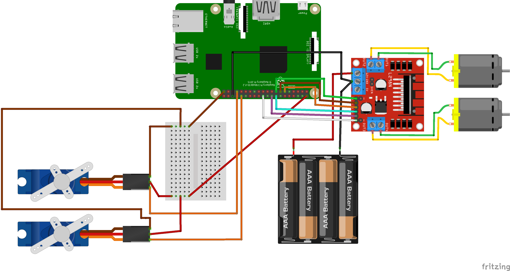
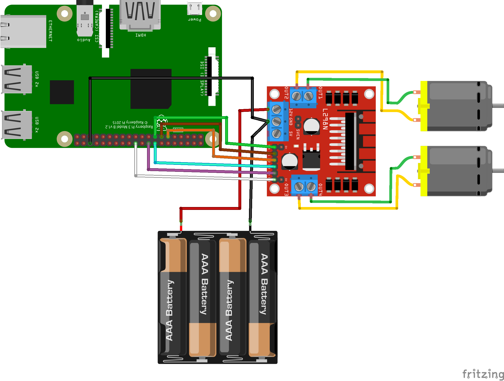
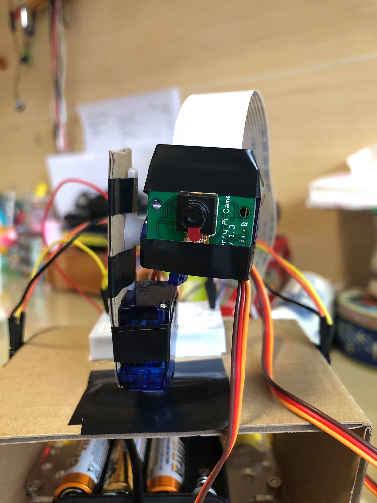
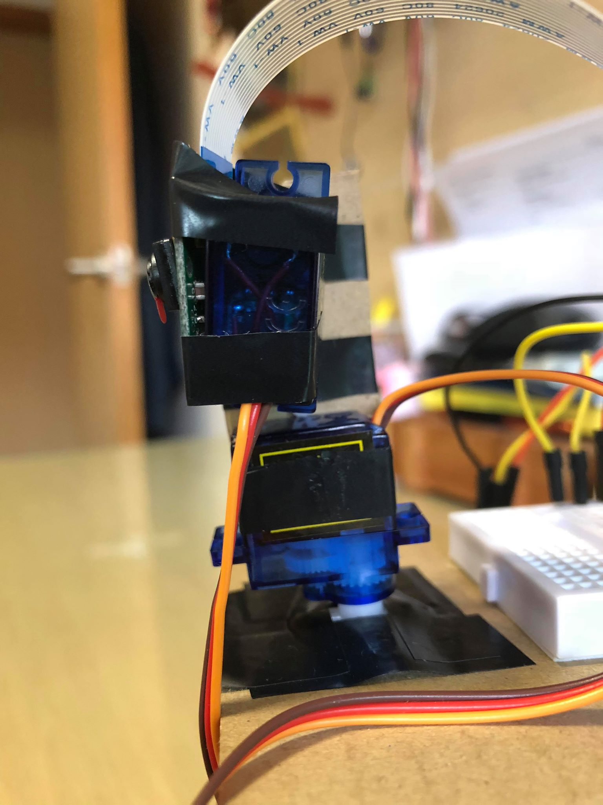

<h1 align="center">
  <br>
  🔭 PiTracker
  <br>
</h1>

<h4 align="center">A deep tracking rover.</h4>

<p align="center">
  <a href="https://opensource.org/licenses/MIT">
    
  </a>
  <a href="https://github.com/jwnicholas99/rpi-rgb-led/releases/">
    
  </a>
  
  
</p>

<p align="center">
  <a href="#key-features">Key Features</a> •
  <a href="#usage">Usage</a> •
  <a href="#setup">Setup</a> •
  <a href="#credits">Credits</a> •
  <a href="#license">License</a>
</p>


PiTracker leverages <b>TensorFlow Lite</b> and a <b>lightweight neural network</b> - Single Shot Detection - in order to deliver <b>tracking</b> at decent <b>3-4 FPS</b> despite the RPi's weak CPU and GPU.

## Key Features

* Control the rover using your keyboard
* Detect objects using TensorFlow Lite (tflite)
* Track a specified object class (eg. person or bird) using a pan-tilt camera with Proportional Integral Derivative (PID) process control

## Usage

```
usage: main.py
``` 
This produces a view from your RPi camera with bounding boxes of objects. Use "WASD" in the terminal to control the rover and the picamera should track any object you specify. Press "E" to exit.

## Setup
There are two parts to the set-up: building the rover and setting up your Raspberry Pi.

### Build Instructions

You need the following hardware:
* Raspberry Pi 4B (at least 2GB recommended)
* [Robot Car Chassis](https://sg.cytron.io/p-2wd-smart-robot-car-chassis?src=us.special.c)
  * TT Motor + Wheel  X 2
  * 4xAA battery holder
  * Acrylic board to hold everything together
* [L298N Motor Driver](https://sg.cytron.io/p-2amp-7v-30v-l298n-motor-driver-stepper-driver-2-channels?src=us.special) (Used to control the motors)
* [5MP Camera for Raspberry Pi](https://sg.cytron.io/p-5mp-camera-board-for-raspberry-pi?search=camera&description=1&src=search.list)
* [FFC Cable longer than 20cm](https://sg.cytron.io/p-raspberry-pi-15-pin-camera-ffc-cable-50cm?search=FFC%20cable&description=1&src=search.list) (as you will need to move your camera around)
* [SG90 Micro Servo](https://sg.cytron.io/p-sg90-micro-servo?search=servo&description=1&src=search.list) X 2 (to pan/tilt camera)
* Mini breadboard
* Jumper wires


<p align="center">

</p>

The above schematic is how to connect all our components together. It might seem a little complicated, but don't worry, it's actually not that complex! There are two parts to the diagram: the motors (the batteries, L298N motor driver and the two DC motors) and the servos (the breadboard and two servos)

#### 1. The motors
<p align="center">

</p>

1. Connect the two DC motors to the L298N motor driver 
2. Connect GPIO BOARD pin 13 to the L298N in1 pin (Brown) 
3. Connect GPIO BOARD pin 11 to the L298N in2 pin (Orange) 
4. Connect GPIO BOARD pin 15 to the L298N en1 pin (Green) 
5. Connect GPIO BOARD pin 16 to the L298N in3 pin (Blue) 
6. Connect GPIO BOARD pin 18 to the L298N in4 pin (Purple) 
7. Connect GPIO BOARD pin 22 to the L298N en2 pin (White) 
8. Connect the batteries to the L298N
9. Connect the L298N to a GPIO GND pin

#### 2. The servos
The servos are much simpler, so just follow that part of the schematic diagram

#### 3. Pan-tilt camera
To build the pan-tilt camera, you just need two servos - one for panning and the other for tilting. You can either buy a Pimoroni one, or just tape together two servos like I did below.

<p align="center">


</p>

### Setting up RPi

#### 1. Enable camera on the Raspberry Pi
In the terminal of your rpi, issue:
```
$ sudo raspi-config
```
Go -> Interfacing Options -> P1 Camera -> Yes 

#### 2. Clone this Github repository
```
$ git clone https://github.com/jwnicholas99/rpi_rover.git
$ cd rpi_rover/
```

#### 3. Create a new venv and install packages

First, create and activate a new virtual environment by issuing:
```
$ python3 -m venv rpi-rover
$ source rpi-rover/bin/activate
```

Second, install required packages for OpenCV
```
$ sudo apt-get -y install libjpeg-dev libtiff5-dev libjasper-dev libpng12-dev
$ sudo apt-get -y install libavcodec-dev libavformat-dev libswscale-dev libv4l-dev
$ sudo apt-get -y install libxvidcore-dev libx264-dev
$ sudo apt-get -y install qt4-dev-tools libatlas-base-dev
$ pip3 install opencv-python==3.4.6.27
```

Third, install Tensorflow Lite. If your Python is version 3.5:
```
$ pip3 install https://dl.google.com/coral/python/tflite_runtime-2.1.0.post1-cp35-cp35m-linux_armv7l.whl
```

If version 3.7:
```
$ pip3 install https://dl.google.com/coral/python/tflite_runtime-2.1.0.post1-cp37-cp37m-linux_armv7l.whl
```

Fourth, install other python packages:
```
$ pip3 install -r requirements.txt
```

#### 4. Update main.py to use your own GPIO pins
It's likely that you will use different GPIO pins, so open up main.py and update the following lines:
```
# right motor
in1 = 13
in2 = 11
en1 = 15

# left motor
in3 = 16
in4 = 18
en2 = 22

# servos are using pigpio, which uses BCM numbering
# while the motors are using BOARD numbering
pan = 12
tilt = 13
```
Note that I am using two different modules for controlling GPIO pins: RPi.GPIO (for interfacing with the motor driver and the wheels) and pigpio (for controlling the servos). This is because pigpio is much more accurate than RPi.GPIO in maintaining pulse width modulation, hence preventing the servos from twitching too much. 

Note that for the RPi.GPIO, I'm using BOARD numbering, while pigpio only allows me to use BCM numbering.


## Credits

* Python - Everything is written in Python
* [EdjeElectronic's repo on using Tensorflow Lite for object detection](https://github.com/EdjeElectronics/TensorFlow-Lite-Object-Detection-on-Android-and-Raspberry-Pi) - I modified his `TFLite_detection_webcam.py` to fit into the PiTracker code
* [Adrian Rosebrock's guide on pan-tilt face tracking](https://www.pyimagesearch.com/2019/04/01/pan-tilt-face-tracking-with-a-raspberry-pi-and-opencv/) - his code formed the base for using PID processes for controlling the pan-tilt camera

## License

This project is licensed under the MIT License - see the [LICENSE.md](LICENSE.md) file for details.